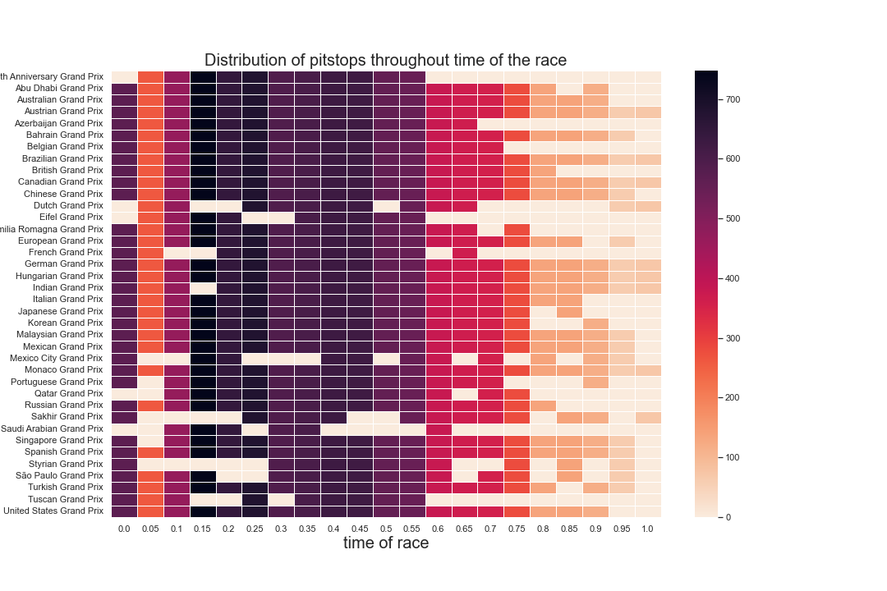
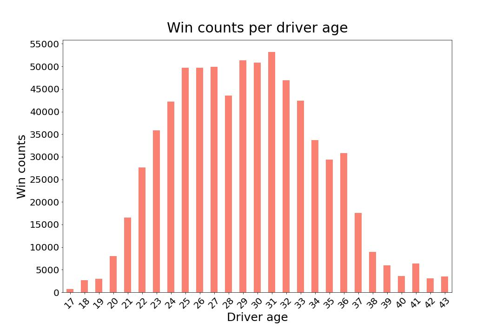
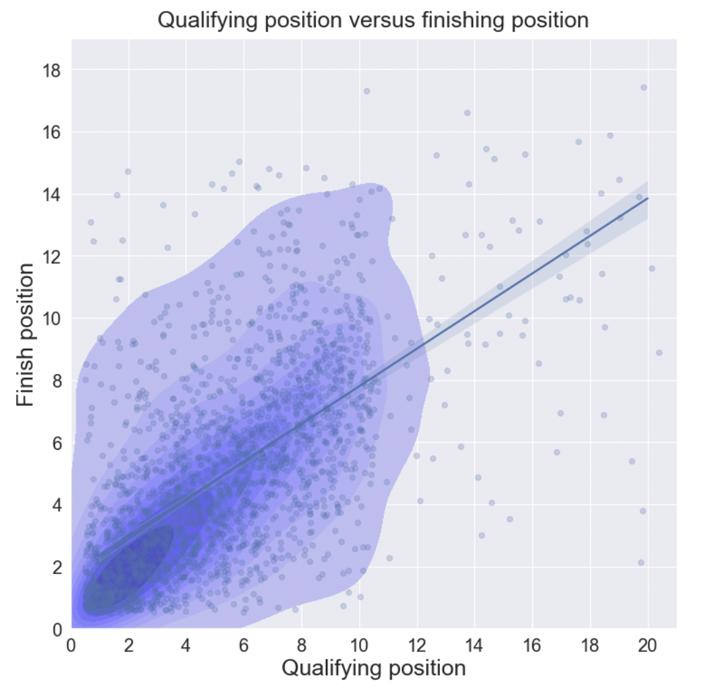
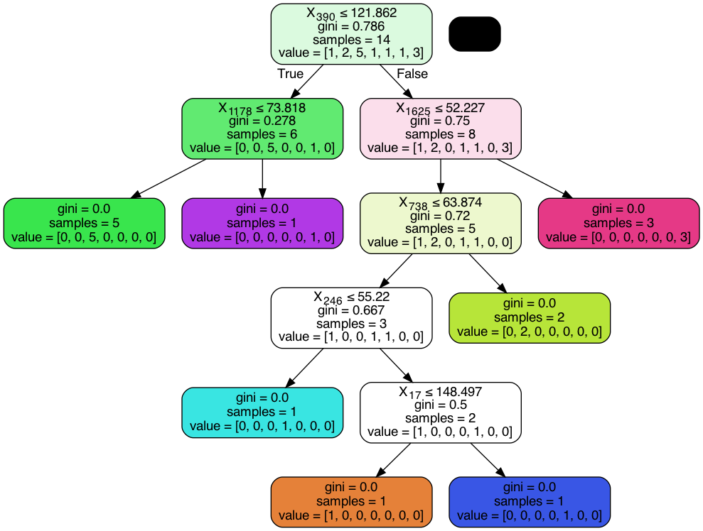

# F1 Datamadness

## Directory   

The work done is organised into 3 notebooks;
- `visualization.ipynb` used to explore and clean the data
- `classifier_data_prep.ipynb` used to prepare the data for use by the classifier
- `classifier.ipynb` used to apply the classifier to the data

Supported by 4 folders;
- `raw_csv` the csvs as we got them from the source
- `clean_csv` the csvs as cleaned and preprocessed by `visualization.ipynb`
- `classification_csvs` the csvs as prepared by `classifier_data_prep.ipynb` for use in the classifier
- `images` various visual outputs of the process, for example the visualisations from `visualization.ipynb` and decision trees/important features from `classifier.ipynb` 

## Video 

We have created a short 2-minute video, highlighting our main findings. Here is a Link to YouTube:

## Ethical consideration
### 1. How did you get the data (legally...)?

The data was obtain from the Ergast Developer API, which is freely available for 
non-commercial use.

### 2. Did you check the source?

The data source was carefully checked, however, there exist some errors, for example, the data incorrectly registers one instance of Bottas’s crash in the Imola in 2021, and some missing data.

### 3. Are there considerations about the analysis you made?

The data is not fully complete, for example, qualifying results are only fully available from the year 2003. Similarly, lap time data is supported from the 1996 season onwards and pit stop data is available from the 2012 season onwards. Therefore, our visualizations can only aggregate data and draw conclusions from those years.

### 4. Did you have to make decisions that affect the analysis?

We have to find and drop some NaN rows/columns in some dataframes, which limits the input for our analysis - see the importer-and-visualizations notebook for details on our decisions.

### 5. What are the limitations of your analysis and your conclusions?

Since qualifying times for the upcoming season are not yet available, it is not possible to predict the race outcomes for next season with our current model. Moreover, due to the limited time and scope of the study, we could not incorporate the weather data into the analysis.

### 6. Who are the stakeholders of your project?

The stakeholders of the project are teammates: Gabriel, Fadi, Thao.

### 7. Who can benefit from this project, who can be harmed, who is excluded, etc.

The people who can benefit from this project are firstly the teammates who will get graded. Secondly, the output of the project is relevant for F1 fans who are interested in the development of this sport and the factors that influence race outcomes. The project is mostly for recreational purposes and uses only publicly available data, thus, it is safe to say that no one can be harmed from this project.

## Visualization
In `visualization.ipynb`, you will find an exploration of the development of the F1 sport over the years and/or across different circuits.
(i.e., the heatmap distribution of the time pitstops happen in the race, how number of pitstops changes over the year)

The relationship between variables such as driver age, win counts, qualifying position, finishing position. 

It seems that drivers have certain prime time in their carreer.

Moreover, qualifying seems to be a good predictor of the race outcome:

The `heatmaps.zip` file contains the evolution of the reasons for (not) finishing a race from 1950 to 2021.

## Classification
The aim of the classification part was to investigate if its possible to predict the constructor championship 
result based on qualifying results only. This question is interesting because some fans argue that wins are 
only because of the best raw car performance, but is this actually the case? Or are there other factors at play? 
The car qualifying result is an interesting indicator of raw car performance as most of the time there is no 
strategy/pit stops/external factors involved so most of the time the fastest car in qualifying is usually actually the 
best car in terms of raw performance.

`classifier_data_prep.ipynb` contains the code that was used to prepare the feature file for this task. 
The rows are organized per year, the class label is the `constructorId` of the constructor that won the 
championship, the features of each class are the qualifying times of 0, 1, or 2 cars (depending on how many finished and availability of data)
of each team for each circuit so for a year Y, there are generally `(number of teams) * (number of cars) * (number of races)`
and the features are different year on year depending on which teams were present and which circuit was raced at.

`classifier.ipynb` Two algorithms were used, a normal decision tree classifier and AdaBoost, Adaboost achieved better results
Accuracy on training data =  1.0
Accuracy on test data =  0.8333333333333334

